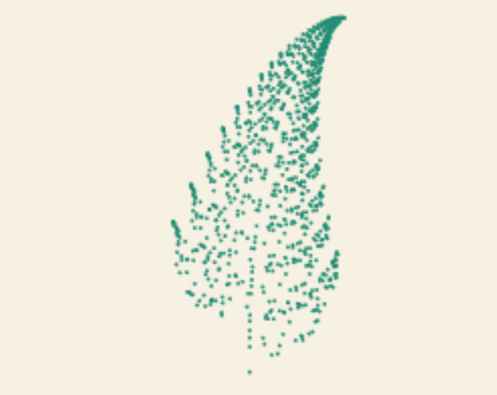
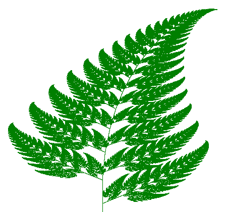

# Animated Barnsley fern

I wanted to recreate the Barnsley fern completely, and instead of just plainly drawing it and adding a few colours, I decided to animate it :D

Quality isn't optimal for performance reasons, but I'm sure you can find [crisp generators online](https://www.chradams.co.uk/fern/maker.html) (this site is also where I got my transformation matrices form).

*Preview of the animation*

*Wikipedia visulization of the Barnsley fern*
